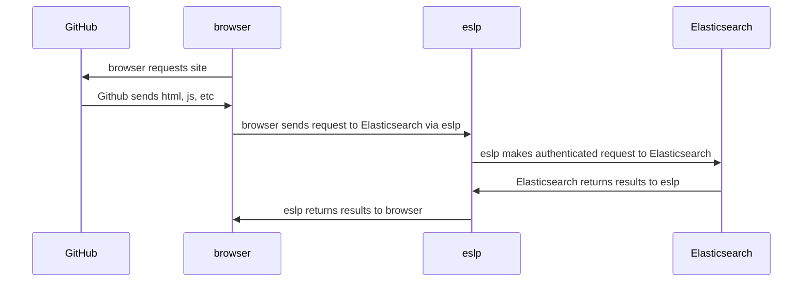

# eslp dashboards

This site is built with the Observable Framework, and requires the use
of `eslp` - elasticsearch local proxy.  It allows you to run dashboards
hosted in a public space, which only access data directly from the
browser.  Luckily, since you're running `elsp`, you have access to 
Elasticsearch and Kibana APIs - CORS friendly and all that.  For
multiple clusters, on the same plane of glass or quickly switchable.

For `eslp`, you will need to be running in https mode, so follow the
instructions to create an SSL certificate to use with `eslp`:

<code>https://github.com/pmuellr/eslp/tree/main/cert</code>

The code also assumes you are running `eslp` using the default port of 19200.

------------------------------------------------------------------------

| site                 | url
| ------               | -----------------------
| dev                  | https://localhost:3000
| public               | https://pmuellr.github.io/eslp-dashboards
| github               | https://github.com/pmuellr/eslp-dashboards
| eslp                 | https://github.com/pmuellr/eslp
| es\|ql               | https://www.elastic.co/guide/en/elasticsearch/reference/current/esql.html
| observable framework | https://observablehq.com/framework/

## how this works

### building the site

We started with the 
[Observable Framework Getting started](https://observablehq.com/framework/getting-started)
page, running `npm init @observablehq` to build the skeleton of the project.
Sadly, this appears to be old code, so put source in `docs` instead of
`src`.  To publish to GitHub Pages, you need to populate `docs` with the
content, so that becomes our output directory.  Also used `cleanUrls: false`,
as I don't want to have to figure out how to make that work on GitHub Pages
with Jekyll, if even possible.  I like it that way anyway!

The workflow is then this:

- run `npm run dev` which starts the dev server on port 3000, with hot
  reloading and all that
- edit and save `.md` and `.js` files, site updated live, and current
  page refreshed
- when ready to publish, kill the `npm run dev`, and run `npm run build`
  to get a clean build; then commit and push and the GitHub Pages site
  will be updated in a short while

### networking between browser and Elasticsearch

For this site anyway, you need to be running 
[`eslp`](https://github.com/pmuellr/eslp) so that the web pages
can connect to Elasticsearch clusters.  The web pages accessing
Elasticsearch are making CORS requests to `eslp`, which sends them
to the appropriate cluster with the specified credentials.  The
proxies you've configured in `eslp` will be visible in the site's
pages in a list (single- or multi-select).

In terms of network topology, the Elasticsearch data never leaves
your local machine, the Observable Framework only provides live
programming client side.

The browser is making requests to the `eslp` proxies, probably from `https`
sites, which is fine
because you're running `eslp` in `https` mode (otherwise it won't work,
for public pages like at Github), and it's sending CORS headers indicating
access from localhost is fine.  

After the browser loads the source files for the site from Github, it
won't access GitHub after that.

